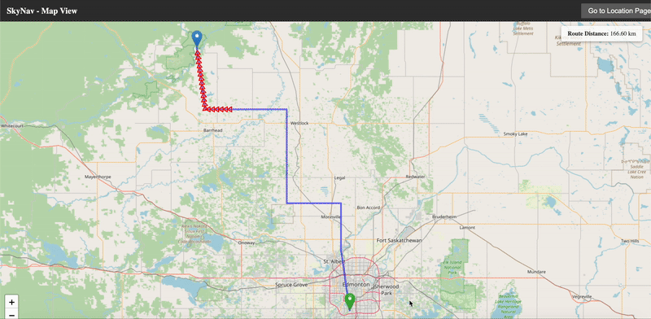

# ✈️ [SKY - NAV](https://skynav.pythonanywhere.com/)

## 🌍 SkyNav: Smart Navigation for Small Aircraft, Helicopters, and Drones

#### SkyNav is a real-time navigation system designed to assist small aircraft, helicopters, and drones in reaching their destination safely and efficiently. Using the A (A-star) pathfinding algorithm, it calculates the shortest and safest route while dynamically avoiding hazardous weather conditions such as snow, hail, and storms. By integrating weather awareness into route planning, SkyNav enhances flight safety and ensures smooth navigation from Point A to Point B.


---

## 🚀 Features
✔ **Shortest Path Calculation** - Uses **A* Algorithm** to find the **most efficient** route.  
✔ **Weather-Aware Routing** - Avoids areas with **bad weather (snow, hail, storms, etc.)**.  
✔ **User Input for Coordinates** - Enter **source and destination coordinates** to get an optimized path.  
✔ **Real-time Updates** - Dynamically adjusts paths based on **weather conditions**.  
✔ **Scalability** - Can be expanded to integrate **live weather APIs** for real-time data.  

---

## 🛠️ Technologies Used
| **Technology** | **Purpose** |
|--------------|------------|
| **Python** | Backend logic, A* algorithm |
| **JavaScript (Node.js)** | CLI-based distance calculation |
| **Flask (or Express.js)** | API for distance & weather handling |
| **OpenWeather API (Future)** | Fetch real-time weather data |

---

## 📥 Installation & Setup

### **1️⃣ Clone the Repository**
```sh
git clone https://github.com/BetterThanYou73/SkyNav-AirArmy.git
cd SkyNav-AirArmy
```

### 2️⃣ Install Dependencies
Depending on which part of the project you are running, install the necessary dependencies.

#### 🐍 For Python Backend
```sh
pip install flask
```

### 🟢 For Node.js CLI (Distance Calculation)
```sh
npm install
```
---

## ⚡️ License  
This project is licensed under the **MIT License**. See the [LICENSE](LICENSE) file for details.

